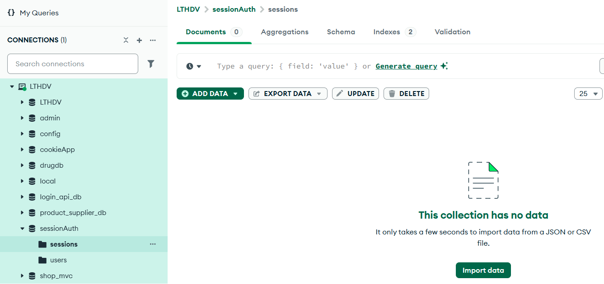

# Cookie Session Authentication

This project demonstrates authentication using **express-session** and **connect-mongo**.  

Users can register, login, maintain a session via cookies (`connect.sid`), and logout.  

Each step is verified not only with Postman but also directly in **MongoDB**.

---

## Installation

1. Clone the repo:

   ```bash

   git clone https://github.com/minhchau-07/cookie_session_auth.git

   cd cookie_session_auth

2. Install dependencies: npm install

3. Run the server: node app.js

4. Server will run at: http://localhost:3000


## Routes and Tests
### 1. Register

POST /auth/register

Body: { "username": "demo", "password": "12345" }

-Postman Result:


-MongoDB Check:





### 2. Login

POST /auth/login

Body: { "username": "demo", "password": "12345" }

-Postman Result:


-MongoDB Check:


### 3. Profile (Protected)

GET /auth/profile

Postman Result (authorized):


MongoDB Check (session still valid):


Postman Result (unauthorized, no cookie):


### 4. Logout

GET /auth/logout

Postman Result:


MongoDB Check (session destroyed):
